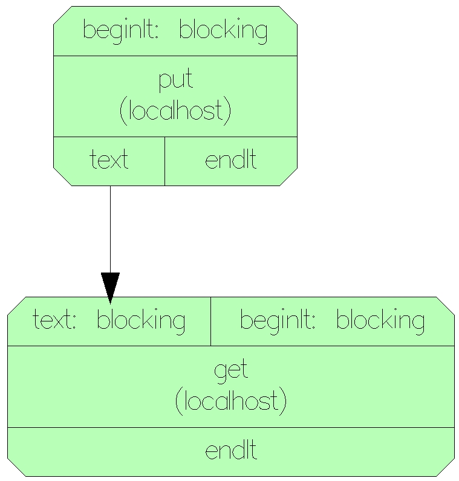
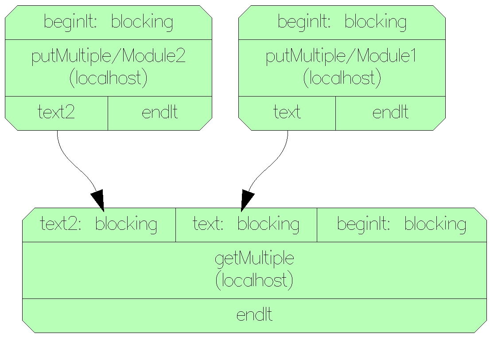
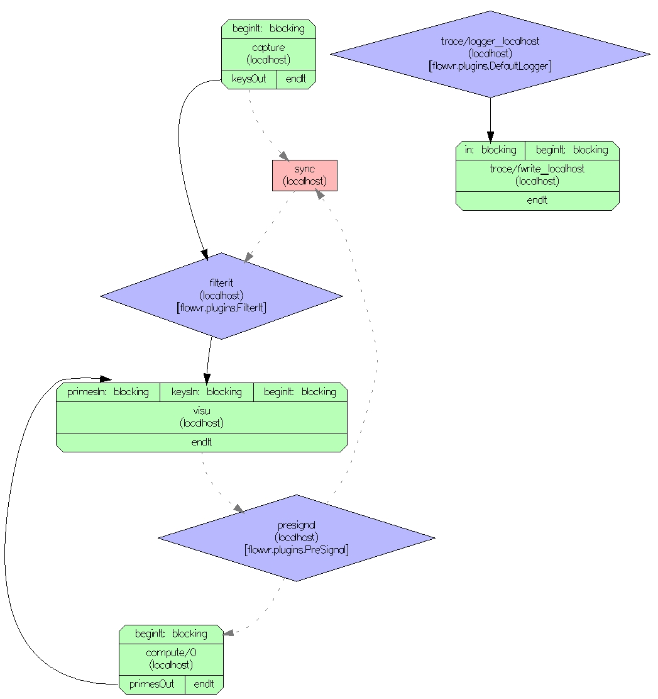
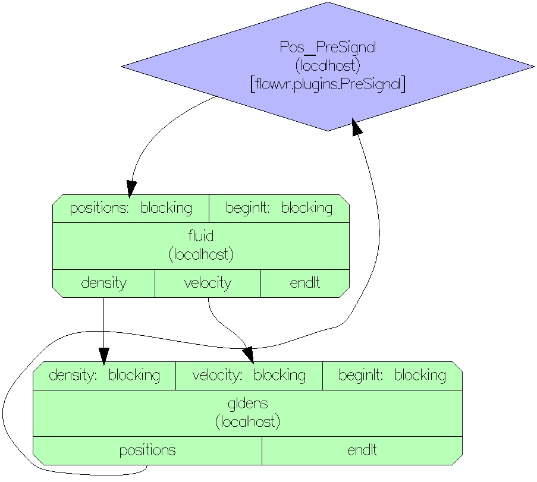

\page FlowVR_plugin The FlowVR plugin

The FlowVR plugin hides FlowVR API calls and logic. Properly created PDI
configuration file allows user to care only about proper input/output calls.

FlowVR plugin does not support the full FlowVR feature set.

## **Configuration elements**

### **Plugin node**

```yaml
plugins:
  flowvr:
```

- `flowvr` name of the plugin, must be children of `plugins` node

### **Component node**

Available components: `module`

Case 1:

```yaml
flowvr:
  component: module
  ...
```

- `flowvr` has single subtree in which `component` is defined
- only one module will be loaded by calling `PDI_init`

Case 2:

```yaml
flowvr:
  - component: module
    ...
  - component: module
    ...
```

- `flowvr` has an array in which `component`s are defined
- `PDI_init` will load all defined modules

### **Component descriptors**

FlowVR does not define any default descriptors. **User has to define all descriptors** in `data` tree outside flowvr tree.

#### **wait_on_data**

```yaml
data:
  wait_desc: int

plugins:
  flowvr:
    component: module
    wait_on_data: wait_desc
```

- `wait_on_data` holds name of the descriptor (data)
- `wait_desc` is a descriptor where PDI will write value returned by module `wait` method
- `wait_desc` must be an integer
- every time user use `wait desc` (by `PDI_expose`) PDI will call `wait` on FlowVR module
- `wait_desc` must be called with write access: `PDI_expose("wait_desc", &wait, PDI_IN)`

#### **wait_on**

```yaml
plugins:
  flowvr:
    component: module
    wait_on: "wait_event"
```

- `wait_on` holds name of the event on which PDI should abort FlowVR module
- should be avoided if possible (not returning the wait status)
- `wait_on` can be an array of events:

```yaml
plugins:
  flowvr:
    component: module
    wait_on: ["wait_event_1", "wait_event_2"]
```

#### **status**

```yaml
data:
  wait_desc: int
  status_desc_1: int
  status_desc_2: int
  status_desc_3: int

plugins:
  flowvr:
    - component: module_1
      wait_on_data: wait_desc
      status: status_desc_1
    - component: module_2
      wait_on_data: wait_desc
      status: [status_desc_2, status_desc_3]
```

- `status` holds name (or array of names) of the descriptor (data)
- `status_desc_x` is a descriptor where PDI will write value returned by module `status` method
- `status_desc_x` must be an integer
- every time user use `status_desc_x` (by PDI_expose) PDI will call `status` on FlowVR module
- `status_desc_x` must be called with write access: `PDI_expose("status_desc_x", &status_x, PDI_IN)`

#### **abort_on**

```yaml
data:
  wait_desc: int

plugins:
  flowvr:
    - component: module_1
      wait_on_data: wait_desc
      abort_on: "abort_event_1"
    - component: module_2
      wait_on_data: wait_desc
      abort_on: ["abort_event_1", "abort_event_2", "abort_event_3"]
```

- `abort_on` holds names (or array of names) of the event on which PDI will call `abort` method

### **parallel**

```yaml
data:
  wait_desc: int
  par_rank_desc: int
  par_size_desc: int

plugins:
  flowvr:
    component: module
    wait_on_data: wait_desc
    parallel:
      get_rank: par_rank_desc
      get_size: par_size_desc
```

- `par_rank_desc` is a descriptor where PDI will write the rank of the process
- `par_size_desc` is a descriptor where PDI will write the size of the world

```yaml
data:
  wait_desc: int
  par_rank_desc: int
  par_size_desc: int

plugins:
  flowvr:
    component: module
    wait_on_data: wait_desc
    parallel:
      set_rank: $par_rank_desc
      set_size: $par_size_desc
```

- `$par_rank_desc` is a value of rank process to pass to flowvr
- `$par_size_desc` is a value of world size to pass to flowvr

### **Input_ports**

```yaml
flowvr:
  ...
  input_ports:
    ...
```

- `input_ports` each port will be set as `flowvr input port` of the module

### **Output_ports**

```yaml
flowvr:
  ...
  output_ports:
    ...
```

- `output_ports` each port will be set as `flowvr output port` of the module

### **Input_port message**

Default type of input port. Flowvr message consists of:

- `data (payload)` simple binary data
- `stamps` flowvr stamps

```yaml
data:
  data_descriptor_name: {type: array, subtype: int, size: 32}

flowvr:
  ...
  input_ports:
    port_1_name:
      data: data_descriptor_name
      stamps:
        ...
    port_2_name:
      event_port: true
      stamps:
        ...
```

- `port_1_name` is the name of the first port (this name is passed to flowvr)
  - `data` is the name of the descriptor where FlowVR plugin will write payload
  - `stamps` the stamps that will be signed to each message received by this port
- `port_2_name` is the name of the second port
  - `event_port` set to true means that this port is defined as event port (non-blocking)
  - `stamps` the stamps that will be signed to each message received by this port
  - no `data` node means that this is STAMP port (message has no payload)

```yaml
metadata:
  received_size : int
data:
  data_descriptor_name: {type: array, subtype: int, size: $received_size/4}

plugins:
  flowvr:
    ...
    input_ports:
      port_1_name:
        data: data_descriptor_name
        size: received_size
```

The user can not always predict how many elements FlowVR will receive. In this case
`size` node type must be a name of metadata where to write the size of received message.
The `received_size` will hold the size of received array, but plugin will set it
**after** user access the `data_descriptor_name` descriptor. The `size` property of descriptor
should be divided by size of element.

### **Output_port message**

Default type of output port. Flowvr message consists of:

- `data (payload)` simple binary data
- `stamps` flowvr stamps

```yaml
data:
  data_descriptor_name:  {type: array, subtype: int, size: 32}

flowvr:
  ...
  output_ports:
    port_1_name:
      data: data_descriptor_name
      data_size: const
      stamps:
        ...
    port_2_name:
      stamps:
        ...
```

- `port_1_name` is the name of the first port (this name is passed to flowvr)
  - `data` is the name of the descriptor from where FlowVR plugin will read payload
  - `data_size` set to `const` means that size of the data will not change (plugin will use FlowVR buffer pools)
  - `stamps` the stamps that will be signed to each message sent by this port
- `port_2_name` is the name of the second port
  - `stamps` the stamps that will be signed to each message sent by this port
  - no `data` node means that this is STAMP port (message has no payload)

User can specify the subsize of data to send in `copy_data_selection`:

```yaml
data:
  data_descriptor_name:  {type: array, subtype: int, size: [32, 32]}

flowvr:
  ...
  output_ports:
    port_1_name:
      data: data_descriptor_name
      copy_data_selection:
        type: array
        subtype: int
        size: [32, 32]
        subsize: [30, 30]
        start: [1, 1]
      data_size: const
      stamps:
        ...
    port_2_name:
      stamps:
        ...
```

`copy_data_selection` has to containt a valid PDI type

### **Stamp**

```yaml
data:
  descriptor_name: int

flowvr:
  ...
  output_ports:
    port_name:
      stamps:
        stamp_name: descriptor_name
```

- `stamp_name` is the name of the stamp inside the FlowVR library
- type of the descriptor must be a valid PDI type, limited to:
  - `int`
  - `float`
  - `array of ints`
  - `array of floats`
  - `array of chars`
- `descriptor_name` is the name of the descriptor where FlowVR plugin will read/write stamp value

### ***Stamp as expression***

For output port user can define stamp as expression value (stamp need type definition in this case):

```yaml
metadata:
  descriptor_name: int

flowvr:
  ...
  output_ports:
    port_name:
      stamps:
        stamp_name:
          type: int
          expression: ($descriptor_name/2) + 3
```

For now only int and string stamps are supported as expression.

### **Input_port chunks**

Chunks allows user to put multiple data in single message.

---
WARNING

After each wait, the first access to the any descriptor (that belongs to the chunks)
will allocate the memory for the all descriptors. This means that all sizes
(if stored as metadata) should be set before first access to any of the descriptors.

---

```yaml
data:
  chunk_1_name: int
  chunk_2_name: {type: array, subtype: char, size: 255}
  chunk_3_name: float

flowvr:
  ...
  input_ports:
    port_name:
      chunks:
        - data: chunk_1_name
        - data: chunk_2_name
        - data: chunk_3_name
      stamps:
        ...
```

- `chunks` indicates that message will hold many data

### **Output_port chunks**

```yaml
data:
  chunk_1_name: int
  chunk_2_name: {type: array, subtype: char, size: 255}
  chunk_3_name: float

flowvr:
  ...
  output_ports:
    port_name:
      chunks:
        - data: chunk_1_name
        - data: chunk_2_name
        - data: chunk_3_name
```

- `chunks` indicates that message will hold many data

### **Input_port event button**

Only when port has a child node named `event_button`. Flowvr message consists of:

- `event_button (payload)` flowvr chunk with buttons
- `stamps` flowvr stamps

```yaml
data:
  up: int
  down: int
  left: int
  right: int

flowvr:
  ...
  input_ports:
    port_1_name:
      event_button:
        KEY_UP: up
        KEY_DOWN: down
        KEY_LEFT: left
        KEY_RIGHT: right
      stamps:
        ...
```

- `port_1_name` is the name of the first port (this name is passed to flowvr)
  - `event_button` indicates that this is `button event port`
  - `KEY_UP` is the predefined name of the `up arrow button`
  - `KEY_DOWN` is the predefined name of the `down arrow button`
  - `KEY_LEFT` is the predefined name of the `left arrow button`
  - `KEY_RIGHT` is the predefined name of the `right arrow button`
  - `up, down, left, right` are the name of the descriptor from where plugin will read the state of the buttons
  - `stamps` the stamps that will be signed to each message received by this port

### **Output_port button event**

Only when port has a child node named `event_button`. Flowvr message consists of:

- `event_button (payload)` flowvr chunk with buttons
- `stamps` flowvr stamps

```yaml
data:
  up: int
  down: int
  left: int
  right: int

flowvr:
  ...
  output_ports:
    port_1_name:
      event_button:
        KEY_UP: up
        KEY_DOWN: down
        KEY_LEFT: left
        KEY_RIGHT: right
      stamps:
        ...
```

- `port_1_name` is the name of the first port (this name is passed to flowvr)
  - `event_button` indicates that this is `button event port`
  - `KEY_UP` is the predefined name of the `up arrow button`
  - `KEY_DOWN` is the predefined name of the `down arrow button`
  - `KEY_LEFT` is the predefined name of the `left arrow button`
  - `KEY_RIGHT` is the predefined name of the `right arrow button`
  - `up, down, left, right` are the name of the descriptor where plugin will write the state of the buttons
  - `stamps` the stamps that will be signed to each message sent by this port

#### **Full list of predefined keys**

- KEY_F1 -> F1
- KEY_F2 -> F2
- KEY_F3 -> F3
- KEY_F4 -> F4
- KEY_F5 -> F5
- KEY_F6 -> F6
- KEY_F7 -> F7
- KEY_F8 -> F8
- KEY_F9 -> F9
- KEY_F10 -> F10
- KEY_F11 -> F11
- KEY_F12 -> F12
- KEY_UP -> Up Arrow
- KEY_DOWN -> Down Arrow
- KEY_LEFT -> Left Arrow
- KEY_RIGHT -> Right Arrow
- KEY_PAGE_UP -> Page Up
- KEY_PAGE_DOWN -> Page Down
- KEY_HOME -> Home
- KEY_END -> End
- KEY_INSERT -> Insert

### **Input_port event mouse**

Only when port has a child node named `event_mouse`. Flowvr message consists of:

- `event_mouse (payload)` flowvr chunk with mouse events
- `stamps` flowvr stamps

```yaml
data:
  pos_xy: {type: array, subtype: float, size: 2}
  left_button: int
  right_button: int
  middle_button: int

flowvr:
  ...
  input_ports:
    port_name:
      event_mouse:
        POS_XY: pos_xy
        LEFT_BUTTON: left_button
        RIGHT_BUTTON: right_button
        MIDDLE_BUTTON: middle_button
      stamps:
        ...
```

- `port_1_name` is the name of the first port (this name is passed to flowvr)
  - `event_mouse` indicates that this is `mouse event port`
  - `POS_XY` is the predefined name of the position of the mouse (always of type `float[2]`)
  - `LEFT_BUTTON` is the predefined name of the `left mouse button` (always of type `int`)
  - `RIGHT_BUTTON` is the predefined name of the `right mouse button` (always of type `int`)
  - `MIDDLE_BUTTON` is the predefined name of the `middle mouse button` (always of type `int`)
  - `stamps` the stamps that will be signed to each message received by this port

### **Output_port mouse event**

Only when port has a child node named `event_mouse`. Flowvr message consists of:

- `event_mouse (payload)` flowvr chunk with mouse events
- `stamps` flowvr stamps

```yaml
data:
  pos_xy: {type: array, subtype: float, size: 2}
  left_button: int
  right_button: int
  middle_button: int

flowvr:
  ...
  output_ports:
    port_name:
      event_mouse:
        POS_XY: pos_xy
        LEFT_BUTTON: left_button
        RIGHT_BUTTON: right_button
        MIDDLE_BUTTON: middle_button
      stamps:
        ...
```

- `port_1_name` is the name of the first port (this name is passed to flowvr)
  - `event_mouse` indicates that this is `mouse event port`
  - `POS_XY` is the predefined name of the position of the mouse (always of type `float[2]`)
  - `LEFT_BUTTON` is the predefined name of the `left mouse button` (always of type `int`)
  - `RIGHT_BUTTON` is the predefined name of the `right mouse button` (always of type `int`)
  - `MIDDLE_BUTTON` is the predefined name of the `middle mouse button` (always of type `int`)
  - `stamps` the stamps that will be signed to each message sent by this port

### **Traces**

```yaml
data:
  trace_descriptor: int

flowvr:
  traces:
    trace_name:
      on_data: trace_descriptor
```

- `trace_name` is the name of the trace passed to flowvr
- `on_data` is the name of the descriptor where trace value is stored, every `PDI_expose` or `PDI_share` on this descriptor writes trace
- `on_data` type must be `int`, `float` and `array of chars`

The following instruction writes trace:

```cpp
  PDI_expose("trace_descriptor", &trace_value, PDI_OUT);
```

## **Reading and writing data**

FlowVR plugin uses 2 ways to handle data reading and writing:

1. Access the shared memory - the fastest way, user operates on flowvr shared memory.

2. Copy the data from shared memory to descriptor - needs the data copy (convenient for small messages).

### **Read data from FlowVR message by access the shared memory**

```yaml
data:
  text_shr: {type: array, subtype: char, size: 4}

...
    input_ports:
      text:
        data: text_shr
```

```cpp
char* text_shr;
PDI_access("text_shr", (void**)&text_shr, PDI_IN);

// do something with text_shr or copy data to local buffer

PDI_release("text_shr"); // really important to release descriptors
```

### **Write data from FlowVR message by access the shared memory**

```yaml
data:
  text_shr: {type: array, subtype: char, size: 4}

...
    output_ports:
      text:
        data: text_shr
```

```cpp
char* text_shr;
PDI_access("text_shr", (void**)&text_shr, PDI_OUT);

// do something with text_shr or copy data from local buffer

PDI_release("text_shr"); // really important to release descriptors
```

### **Read data from FlowVR message by copy from the shared memory**

```yaml
data:
  text: {type: array, subtype: char, size: 4}

...
    input_ports:
      text:
        data: text
```

```cpp
char text[4];
PDI_expose("text", text, PDI_IN);
```

### **Write data to FlowVR message by copy to the shared memory**

```yaml
data:
  text: {type: array, subtype: char, size: 4}

...
    output_ports:
      text:
        data: text
```

```cpp
char text[4];
PDI_expose("text", text, PDI_OUT);
```

### **Write data to FlowVR message by copy the subset of data to the shared memory**

```yaml
data:
  my_array: {type: array, subtype: int, size: [20, 20]}

...
    output_ports:
      text:
        data: my_array
        copy_data_selection: {type: array, subtype: int, size: [20, 20], subsize: [10, 10], start: [0, 0]}
```

```cpp
int my_array[400];
PDI_expose("my_array", my_array, PDI_OUT); // copies only 100 elements
```

## **Reading and writing stamps**

Stamps are always copied from descriptor to flowvr message.

### **Read stamp from FlowVR message**

```yaml
data:
  stamp_it: int
...
    input_ports:
      text:
        stamps:
          it: stamp_it
```

```cpp
int stamp_it = some_value;
PDI_expose("stamp_it", &stamp_it, PDI_IN);
```

### **Write stamp from FlowVR message**

```yaml
data:
  user_stamp: int

...
    output_ports:
      text:
        stamps:
          user_defined_stamp: user_stamp
```

```cpp
int user_stamp = some_value;
PDI_expose("user_stamp", &user_stamp, PDI_OUT);
```

## **Reading and writing mouse event**

### **Write mouse event from FlowVR message**

```yaml
data:
  pos_xy: {type: array, subtype: float, size: 2}
  left_button: int

...
    output_ports:
      keysOut:
        event_mouse:
          POS_XY: pos_xy
          LEFT_BUTTON: left_button
```

```cpp
float pos_xy[2] = {x_pos, y_pos};
PDI_expose("pos_xy", &pos_xy, PDI_OUT);

int left_button = 1;
PDI_expose("left_button", &left_button, PDI_OUT);
```

### **Read mouse event from FlowVR message**

```yaml
data:
  pos_xy: {type: array, subtype: float, size: 2}
  left_button: int

...
input_ports:
  keysIn:
    event_mouse:
      POS_XY: pos_xy
      LEFT_BUTTON: left_button
```

```cpp
float pos_xy;
PDI_expose("pos_xy", &pos_xy, PDI_IN);

int left_button;
PDI_expose("left_button", &left_button, PDI_IN);
```

### **Write button event from FlowVR message**

```yaml
data:
  up: int
  down: int

...
    output_ports:
      keysOut:
        event_button:
          KEY_UP: up
          KEY_DOWN: down
```

```cpp
int up_state = 1;
PDI_expose("up", &up_state, PDI_OUT);

int down_state = 1;
PDI_expose("down", &down_state, PDI_OUT);
```

### **Read button event from FlowVR message**

```yaml
data:
  up: int
  down: int

...
    input_ports:
      keysIn:
        event_button:
          KEY_UP: up
          KEY_DOWN: down
```

```cpp
int up_state;
PDI_expose("up", &up_state, PDI_IN);

int down_state;
PDI_expose("down", &down_state, PDI_IN);
```

## **Examples**

Path to the examples:

```path
  pdi/build/pdi_plugin-flowvr/src/FLOWVR_PLUGIN-build/examples/
```

Original flowvr source files are in directiories `flowvr_original`.

### **Running the application**

1. Go to examples folder: `cd pdi_plugin-flowvr/src/FLOWVR_PLUGIN-build/examples`
2. Run `source flowvr-config.sh`. Now your environment is ready.
3. Run flowvr deamon on your system (best in new terminal, repeat 1. and 2.): `flowvrd --top`
4. Inside `$example_name` directory generate the flowvr configuration files by: `python $example_name.py` and run example by: `flowvr $example_name`

### **Tictac example**

Consists of 2 modules:

- `put`
  - source file: `put.cxx`
  - configuration file: `put.yml`
  - has `output port` named `text`
  - sends message with:
    - `data` (payload):
      ```yaml
      type: {type: array, subtype: char, size: 4} # "tic" or "tac"
      ```
    - `stamps`:
      - `it` (predefined flowvr stamp)
        ```yaml
        type: int
        ```
      - `my_stamp` (user define int array stamp)
        ```yaml
        type: {type: array, subtype: int, size: 2}
        ```

- `get`
  - source file: `get.cxx`
  - configuration file: `get.yml`
  - has `input port` named `text`
  - receive message sent by `put` module
  - additionally has defined `stamp`:
    - `source` (predefined flowvr stamp)
      ```yaml
      type: {type: array, subtype: char, size: 256}
      ```

#### **Network of the application:**



### **Bundle example**

Consists of 3 modules:

- 2x `putMulitple`
  - source file: `putMulitple.cxx`
  - configuration file: `putMulitple.yml`
  - first one has `output port` named `text`, second `text2`
  - sends message with:
    - `data` (payload):
      ```yaml
      type: {type: array, subtype: char, size: 4} # first "tic" or "tac", second "TIC" or "TAC"
      ```
    - `stamps`:
      - `it` (predefined flowvr stamp)
      ```yaml
      type: int
      ```

- `getMulitple`
  - source file: `getMulitple.cxx`
  - configuration file: `getMulitple.yml`
  - has `input ports` named `text` and `text2`
  - receive message sent by `putMulitple` modules
  - additionally has defined `stamp`:
    - `source` (predefined flowvr stamp)
      ```yaml
      type: {type: array, subtype: char, size: 256}
      ```

#### **Network of the application:**



### **Primes example**

Consists of 3 modules:

- `capture`
  - source file: `capture.cxx`
  - configuration file: `capture.yml`
  - has `output port` named `keysOut`
  - sends message with:
    - `event_button` (payload):
      ```yaml
          KEY_UP: up
          KEY_DOWN: down
          KEY_LEFT: left
          KEY_RIGHT: right
      ```

- `compute`
  - source file: `compute.cxx`
  - configuration file: `compute.yml`
  - has `output port` named `primesOut`
  - sends message with:
    - `data` (payload):
      ```yaml
      type: {type: array, subtype: int, size: $tempPrimeNumbersMaxCount}
      ```
    - `stamps`:
      - `computationTimeIt`
        ```yaml
        type: int
        ```

- `visu`
  - source file: `visu.cxx`
  - configuration file: `visu.yml`
  - has trace `myTraceKeyPressedNotification`
    ```yaml
    type: int
    ```
  - has `input ports` named `primesIn` and `keysIn`
  - receive message sent by `capture` and `compute` modules

#### **Network of the application:**



### **Fluid example**

Consists of 2 modules:

- `fluid`
  - source file: `fluid.cxx`
  - configuration file: `fluid.yml`
  - has `input port` named `position`
  - received message sent by `gldens` module
  - has `output ports` named `velocity` and `density`
  - `velocity` and `density` both sends message with:
    - `data` (payload):
      ```yaml
          type: {type: array, subtype: char, size: [$NX * 2, $NY]} # where NX and NY is metadata
      ```
    - `stamps`:
      - `P`:
        ```yaml
        type: {type: array, subtype: int, size: 2}
        ```
      - `N`:
        ```yaml
        type: {type: array, subtype: int, size: 2}
        ```

- `gldens`
  - source file: `gldens.cxx`
  - configuration file: `gldens.yml`
  - has `input ports` named `velocity` and  `density`
  - received message sent by `fluid` module
  - has `output port` named `position`
  - sends message with:
    - `data` (payload):
      ```yaml
      type: {type: array, subtype: float, size: 3}
      ```
  - very important is how to get a number of elements received by `velocity` and  `density` ports:
      ```yaml
      type: {type: array, subtype: char, size: $velocitySize} #velocitySize is defined as metadata
      ```
      Here `velocitySize` must be preceded with `$` to let plugin to write the size there. The `velocitySize` descriptor will store a valid size **after** accessing the `velocity` descriptor, because only then plugin will write size.

#### **Network of the application:**


