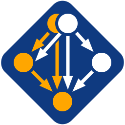
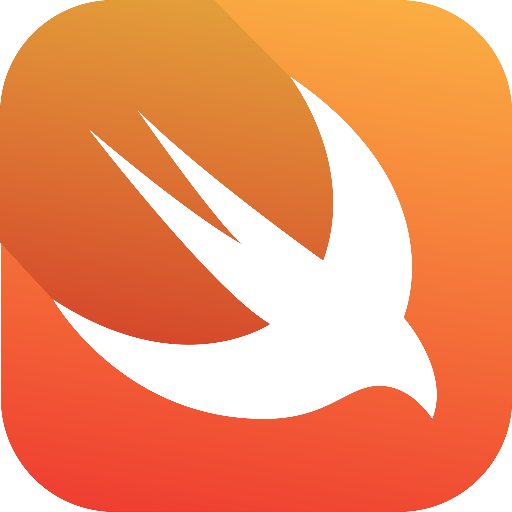
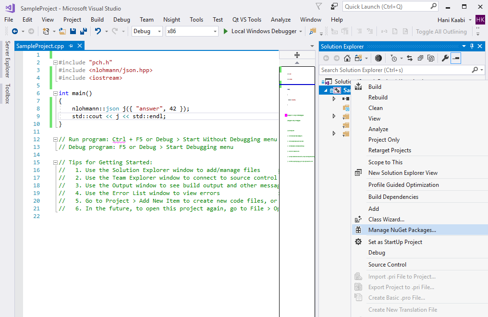
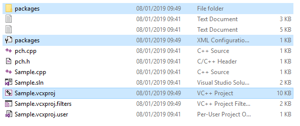
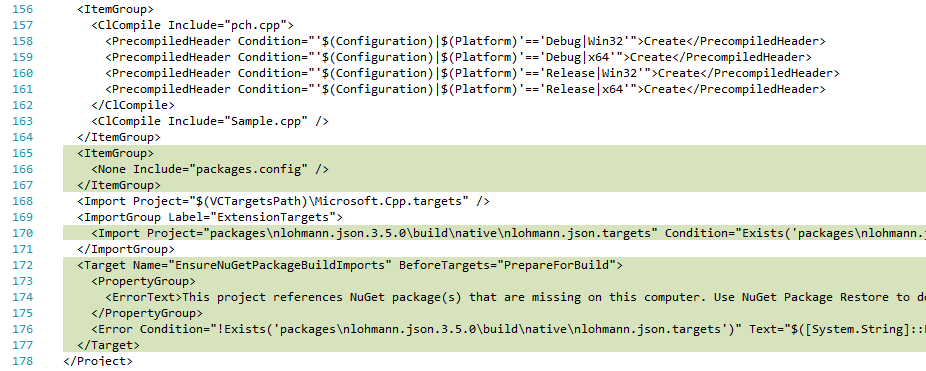

# Package Managers

<center>
{: style="height:1em"}&nbsp;[**Homebrew**](#homebrew) `nlohmann-json` &emsp;
{: style="height:1em"}&nbsp;[**Meson**](#meson) `nlohmann_json` &emsp;
{: style="height:1em"}&nbsp;[**Bazel**](#bazel) `nlohmann_json`<br>
{: style="height:1em"}&nbsp;[**Conan**](#conan) `nlohmann_json` &emsp;
{: style="height:1em"}&nbsp;[**Spack**](#spack) `nlohmann-json` &emsp;
[**Hunter**](#hunter) `nlohmann_json`<br>
{: style="height:1em"}&nbsp;[**vcpkg**](#vcpkg) `nlohmann-json` &emsp;
[**cget**](#cget) `nlohmann/json` &emsp;
{: style="height:1em"}&nbsp;[**Swift Package Manager**](#swift-package-manager) `nlohmann/json`<br>
{: style="height:1em"}&nbsp;[**NuGet**](#nuget) `nlohmann.json` &emsp;
{: style="height:1em"}&nbsp;[**Conda**](#conda) `nlohmann_json` &emsp;
{: style="height:1em"}&nbsp;[**MacPorts**](#macports) `nlohmann-json`<br>
{: style="height:1em"}&nbsp;[**CPM.cmake**](#cpmcmake) `gh:nlohmann/json`
{: style="height:1em"}&nbsp;[**xmake**](#xmake) `nlohmann_json`
</center>

## Running example

Throughout this page, we will describe how to compile the example file `example.cpp` below.

```cpp
--8<-- "integration/example.cpp"
```

When executed, this program should create output similar to

```json
--8<-- "examples/meta.output"
```

## Homebrew

!!! abstract "Summary"

    formula: [**`nlohmann-json`**](https://formulae.brew.sh/formula/nlohmann-json)

    - [](https://repology.org/project/nlohmann-json/versions)
    - :octicons-tag-24: Availalbe versions: current version and development version (with `--HEAD` parameter)
    - :octicons-rocket-24: The formula is updated with every release.
    - :octicons-person-24: Maintainer: Niels Lohmann
    - :octicons-file-24: File issues at the [Homebrew issue tracker](https://github.com/Homebrew/homebrew-core/issues)
    - :octicons-question-24: [Homebrew website](https://brew.sh)

If you are using [Homebrew](http://brew.sh), you can install the library with

```sh
brew install nlohmann-json
```

The header can be used directly in your code or via CMake.

??? example "Example: Raw compilation"

    1. Create the following file:

        ```cpp title="example.cpp"
        --8<-- "integration/homebrew/example.cpp"
        ```

    2. Install the package:

        ```sh
        brew install nlohmann-json
        ```

    3. Compile the code and pass the Homebrew prefix to the include path such that the library can be found:

        ```sh
        c++ example.cpp -I$(brew --prefix nlohmann-json)/include -std=c++11 -o example
        ```

??? example "Example: CMake"

    1. Create the following files:

        ```cpp title="example.cpp"
        --8<-- "integration/homebrew/example.cpp"
        ```

        ```cmake title="CMakeLists.txt"
        --8<-- "integration/homebrew/CMakeLists.txt"
        ```

    2. Install the package:

        ```sh
        brew install nlohmann-json
        ```

    3. Compile the code and pass the Homebrew prefix to CMake to find installed packages via `#!cmake find_package`:

        ```sh
        CMAKE_PREFIX_PATH=$(brew --prefix) cmake -S . -B build
        cmake --build build
        ```

## Meson

!!! abstract "Summary"

    wrap: **`nlohmann_json`**

    - :octicons-tag-24: Availalbe versions: current version and select older versions (see
      [WrapDB](https://mesonbuild.com/Wrapdb-projects.html))
    - :octicons-rocket-24: The package is update automatically from file
      [`meson.build`](https://github.com/nlohmann/json/blob/develop/meson.build).
    - :octicons-file-24: File issues at the [library issue tracker](https://github.com/nlohmann/json/issues)
    - :octicons-question-24: [Meson website](https://mesonbuild.com/index.html)

If you are using the [Meson Build System](http://mesonbuild.com), add this source tree as a [meson subproject](https://mesonbuild.com/Subprojects.html#using-a-subproject). You may also use the
`include.zip` published in this project's [Releases](https://github.com/nlohmann/json/releases) to reduce the size of the vendored source tree. Alternatively,
you can get a wrap file by downloading it from [Meson WrapDB](https://mesonbuild.com/Wrapdb-projects.html), or use

```shell
meson wrap install nlohmann_json
```

Please see the Meson project for any issues regarding the packaging.

The provided `meson.build` can also be used as an alternative to CMake for installing `nlohmann_json` system-wide in
which case a pkg-config file is installed. To use it, have your build system require the `nlohmann_json`
pkg-config dependency. In Meson, it is preferred to use the
[`dependency()`](https://mesonbuild.com/Reference-manual.html#dependency) object with a subproject fallback, rather than
using the subproject directly.

??? example "Example: Wrap"

    1. Create the following files:

        ```ini title="meson.build"
        --8<-- "integration/meson/meson.build"
        ```

        ```cpp title="example.cpp"
        --8<-- "integration/meson/example.cpp"
        ```

    2. Use the Meson WrapDB to fetch the nlohmann/json wrap:

        ```shell
        mkdir subprojects
        meson wrap install nlohmann_json
        ```

    3. Build:

        ```shell
        meson setup build
        meson compile -C build
        ```

## Bazel

!!! abstract "Summary"

    use `bazel_dep`, `git_override`, or `local_path_override`

    - :octicons-tag-24: Any version, that is available via [Bazel Central Registry](https://registry.bazel.build/modules/nlohmann_json)
    - :octicons-file-24: File issues at the [library issue tracker](https://github.com/nlohmann/json/issues)
    - :octicons-question-24: [Bazel website](https://bazel.build)

This repository provides a [Bazel](https://bazel.build/) `MODULE.bazel` and a corresponding `BUILD.bazel` file. Therefore, this
repository can be referenced within a `MODULE.bazel` by rules such as `archive_override`, `git_override`, or `local_path_override`. To use the library you need to depend on the target `@nlohmann_json//:json` (i.e., via `deps` attribute).

??? example

    1. Create the following files:

        ```ini title="BUILD"
        --8<-- "integration/bazel/BUILD"
        ```

        ```ini title="WORKSPACE"
        --8<-- "integration/bazel/MODULE.bazel"
        ```

        ```cpp title="example.cpp"
        --8<-- "integration/bazel/example.cpp"
        ```

    2. Build and run:

        ```shell
        bazel build //:main
        bazel run //:main
        ```

## Conan

!!! abstract "Summary"

    recipe: [**`nlohmann_json`**](https://conan.io/center/recipes/nlohmann_json)

    - [](https://repology.org/project/nlohmann-json/versions)
    - :octicons-tag-24: Availalbe versions: current version and older versions (see
      [Conan Center](https://conan.io/center/recipes/nlohmann_json))
    - :octicons-rocket-24: The package is update automatically via
      [this recipe](https://github.com/conan-io/conan-center-index/tree/master/recipes/nlohmann_json).
    - :octicons-file-24: File issues at the [Conan Center issue tracker](https://github.com/conan-io/conan-center-index/issues)
    - :octicons-question-24: [Conan website](https://conan.io)

If you are using [Conan](https://www.conan.io/) to manage your dependencies, merely add `nlohmann_json/x.y.z` to your `conanfile`'s
requires, where `x.y.z` is the release version you want to use.

??? example

    1. Create the following files:

        ```ini title="Conanfile.txt"
        --8<-- "integration/conan/Conanfile.txt"
        ```

        ```cmake title="CMakeLists.txt"
        --8<-- "integration/conan/CMakeLists.txt"
        ```

        ```cpp title="example.cpp"
        --8<-- "integration/conan/example.cpp"
        ```

    2. Call Conan:

        ```sh
        conan install . --output-folder=build --build=missing
        ```

    3. Build:

        ```sh
        cmake -S . -B build -DCMAKE_TOOLCHAIN_FILE="conan_toolchain.cmake" -DCMAKE_BUILD_TYPE=Release
        cmake --build build
        ```

## Spack

!!! abstract "Summary"

    package: [**`nlohmann-json`**](https://packages.spack.io/package.html?name=nlohmann-json)

    - [](https://repology.org/project/nlohmann-json/versions)
    - :octicons-tag-24: Availalbe versions: current version and older versions (see
      [Spack package](https://packages.spack.io/package.html?name=nlohmann-json))
    - :octicons-rocket-24: The package is updated with every release.
    - :octicons-person-24: Maintainer: [Axel Huebl](https://github.com/ax3l)
    - :octicons-file-24: File issues at the [Spack issue tracker](https://github.com/spack/spack/issues)
    - :octicons-question-24: [Spack website](https://spack.io)

If you are using [Spack](https://www.spack.io/) to manage your dependencies, you can use the
[`nlohmann-json` package](https://packages.spack.io/package.html?name=nlohmann-json) via

```shell
spack install nlohmann-json
```

Please see the [Spack project](https://github.com/spack/spack) for any issues regarding the packaging.

??? example

    1. Create the following files:

        ```cmake title="CMakeLists.txt"
        --8<-- "integration/spack/CMakeLists.txt"
        ```

        ```cpp title="example.cpp"
        --8<-- "integration/spack/example.cpp"
        ```

    2. Install the library:

        ```sh
        spack install nlohmann-json
        ```

    3. Load the environment for your Spack-installed packages:

        ```sh
        spack load nlohmann-json
        ```

    4. Build the project with CMake:

        ```sh
        cmake -S . -B build -DCMAKE_PREFIX_PATH=$(spack location -i nlohmann-json)
        cmake --build build
        ```

## Hunter

!!! abstract "Summary"

    package: [**`nlohmann_json`**](https://hunter.readthedocs.io/en/latest/packages/pkg/nlohmann_json.html)

    - :octicons-tag-24: Availalbe versions: current version and older versions (see
      [Hunter package](https://hunter.readthedocs.io/en/latest/packages/pkg/nlohmann_json.html))
    - :octicons-rocket-24: The package is updated with every release.
    - :octicons-file-24: File issues at the [Hunter issue tracker](https://github.com/cpp-pm/hunter/issues)
    - :octicons-question-24: [Hunter website](https://hunter.readthedocs.io/en/latest/)

If you are using [Hunter](https://github.com/cpp-pm/hunter) on your project for external dependencies, then you can use
the [nlohmann_json package](https://hunter.readthedocs.io/en/latest/packages/pkg/nlohmann_json.html) via

```cmake
hunter_add_package(nlohmann_json)
```

Please see the  Hunter project for any issues regarding the packaging.

??? example

    1. Create the following files:

        ```cmake title="CMakeLists.txt"
        --8<-- "integration/hunter/CMakeLists.txt"
        ```

        ```cpp title="example.cpp"
        --8<-- "integration/hunter/example.cpp"
        ```

    2. Download required files

        ```shell
        mkdir cmake
        wget https://raw.githubusercontent.com/cpp-pm/gate/master/cmake/HunterGate.cmake -O cmake/HunterGate.cmake
        ```

    3. Build the project with CMake:

        ```shell
        cmake -S . -B build
        cmake --build build
        ```

## vcpkg

!!! abstract "Summary"

    package: [**`nlohmann-json`**](https://github.com/Microsoft/vcpkg/tree/master/ports/nlohmann-json)

    - [](https://repology.org/project/nlohmann-json/versions)
    - :octicons-tag-24: Availalbe versions: current version
    - :octicons-rocket-24: The package is updated with every release.
    - :octicons-file-24: File issues at the [vcpkg issue tracker](https://github.com/microsoft/vcpkg/issues)
    - :octicons-question-24: [vcpkg website](https://vcpkg.io/)

If you are using [vcpkg](https://github.com/Microsoft/vcpkg/) on your project for external dependencies, then you can
install the [nlohmann-json package](https://github.com/Microsoft/vcpkg/tree/master/ports/nlohmann-json) with

```shell
vcpkg install nlohmann-json
```

and follow the then displayed descriptions. Please see the vcpkg project for any issues regarding the packaging.

??? example

    1. Create the following files:

        ```cmake title="CMakeLists.txt"
        --8<-- "integration/vcpkg/CMakeLists.txt"
        ```
    
        ```cpp title="example.cpp"
        --8<-- "integration/vcpkg/example.cpp"
        ```

    2. Install package:

        ```sh
        vcpkg install nlohmann-json
        ```

    3. Build:

        ```sh
        cmake -S . -B build -DCMAKE_TOOLCHAIN_FILE=$VCPKG_ROOT/scripts/buildsystems/vcpkg.cmake
        cmake --build build
        ```

## cget

!!! abstract "Summary"

    package: [**`nlohmann/json`**](https://github.com/pfultz2/cget-recipes/blob/master/recipes/nlohmann/json/package.txt)

    - :octicons-tag-24: Availalbe versions: current version and older versions
    - :octicons-rocket-24: The package is updated with every release.
    - :octicons-file-24: File issues at the [cget issue tracker](https://github.com/pfultz2/cget-recipes/issues)
    - :octicons-question-24: [cget website](https://cget.readthedocs.io/)

If you are using [cget](http://cget.readthedocs.io/en/latest/), you can install the latest `master` version with

```shell
cget install nlohmann/json
```

A specific version can be installed with `cget install nlohmann/json@v3.11.3`. Also, the multiple header version can be
installed by adding the `-DJSON_MultipleHeaders=ON` flag (i.e., `cget install nlohmann/json -DJSON_MultipleHeaders=ON`).

??? example

    1. Create the following files:

        ```cmake title="CMakeLists.txt"
        --8<-- "integration/vcpkg/CMakeLists.txt"
        ```
    
        ```cpp title="example.cpp"
        --8<-- "integration/vcpkg/example.cpp"
        ```

    2. Initialize cget

        ```shell
        cget init
        ```
 
    3. Install the library

        ```shell
        cget install nlohmann/json
        ```

    4. Build

        ```shell
        cmake -S . -B build -DCMAKE_TOOLCHAIN_FILE=cget/cget/cget.cmake
        cmake --build build
        ```

## Swift Package Manager

!!! abstract "Summary"

    package: **`nlohmann/json`**

    - :octicons-tag-24: Availalbe versions: current version and older versions
    - :octicons-rocket-24: The package is updated with every release.
    - :octicons-file-24: File issues at the [library issue tracker](https://github.com/nlohmann/json/issues)
    - :octicons-question-24: [Xcode documentation](https://developer.apple.com/documentation/xcode/adding-package-dependencies-to-your-app)

## NuGet

!!! abstract "Summary"

    package: [**`nlohmann.json`**](https://www.nuget.org/packages/nlohmann.json/)

    - :octicons-tag-24: Availalbe versions: current and previous versions
    - :octicons-rocket-24: The package is updated with every release.
    - :octicons-person-24: Maintainer: [Hani Kaabi](https://github.com/hnkb)
    - :octicons-file-24: File issues at the [maintainer's issue tracker](https://github.com/hnkb/nlohmann-json-nuget/issues)
    - :octicons-question-24: [NuGet website](https://www.nuget.org)

If you are using [NuGet](https://www.nuget.org), you can use the package [nlohmann.json](https://www.nuget.org/packages/nlohmann.json/)
with

```shell
dotnet add package nlohmann.json
```

??? example

    Probably the easiest way to use NuGet packages is through Visual Studio graphical interface. Just right-click on a
    project (any C++ project would do) in “Solution Explorer” and select “Manage NuGet Packages…”

    

    Now you can click on “Browse” tab and find the package you like to install.

    

    Most of the packages in NuGet gallery are .NET packages and would not be useful in a C++ project. Microsoft
    recommends adding “native” and “nativepackage” tags to C++ NuGet packages to distinguish them, but even adding
    “native” to search query would still show many .NET-only packages in the list.
    
    Nevertheless, after finding the package you want, click on “Install” button and accept confirmation dialogs.
    After the package is successfully added to the projects, you should be able to build and execute the project
    without the need for making any more changes to build settings.

    !!! note

        A few notes:
    
        - NuGet packages are installed per project and not system-wide. The header and binaries for the package are only
          available to the project it is added to, and not other projects (obviously unless we add the package to those
          projects as well)
        - One of the many great things about your elegant work is that it is a header-only library, which makes
          deployment very straightforward. In case of libraries which need binary deployment (`.lib`, `.dll` and `.pdb`
          for debug info) the different binaries for each supported compiler version must be added to the NuGet package.
          Some library creators cram binary versions for all supported Visual C++ compiler versions in the same package,
          so a single package will support all compilers. Some others create a different package for each compiler
          version (and you usually see things like “v140” or “vc141” in package name to clarify which VC++ compiler this
          package supports).
        - Packages can have dependency to other packages, and in this case, NuGet will install all dependencies as well
          as the requested package recursively.

    **What happens behind the scenes**

    After you add a NuGet package, three changes occur in the project source directory. Of course, we could make these
    changes manually instead of using GUI:
    
    
    
    1. A `packages.config` file will be created (or updated to include the package name if one such file already
       exists). This file contains a list of the packages required by this project (name and minimum version) and must
       be added to the project source code repository, so if you move the source code to a new machine, MSBuild/NuGet
       knows which packages it has to restore (which it does automatically before each build).

        ```xml
        <?xml version="1.0" encoding="utf-8"?>
        <packages>
          <package id="nlohmann.json" version="3.5.0" targetFramework="native" />
        </packages>
        ```

    2. A `packages` folder which contains actual files in the packages (these are header and binary files required for
       a successful build, plus a few metadata files). In case of this library for example, it contains `json.hpp`:
    
        
    
        !!! note

            This directory should not be added to the project source code repository, as it will be restored before each
            build by MSBuild/NuGet. If you go ahead and delete this folder, then build the project again, it will
            magically re-appear!
    
    3. Project MSBuild makefile (which for Visual C++ projects has a .vcxproj extension) will be updated to include
       settings from the package.
    
        
    
        The important bit for us here is line 170, which tells MSBuild to import settings from
        `packages\nlohmann.json.3.5.0\build\native\nlohmann.json.targets` file. This is a file the package creator
        created and added to the package (you can see it is one of the two files I created in this repository, the other
        just contains package attributes like name and version number). What does it contain?
    
        For our header-only repository, the only setting we need is to add our include directory to the list of
        `AdditionalIncludeDirectories`:

        ```xml    
        <?xml version="1.0" encoding="utf-8"?>
        <Project ToolsVersion="4.0" xmlns="http://schemas.microsoft.com/developer/msbuild/2003">
            <ItemDefinitionGroup>
                <ClCompile>
                    <AdditionalIncludeDirectories>$(MSBuildThisFileDirectory)include;%(AdditionalIncludeDirectories)</AdditionalIncludeDirectories>
                </ClCompile>
            </ItemDefinitionGroup>
        </Project>
        ```

        For libraries with binary files, we will need to add `.lib` files to linker inputs and add settings to copy
        `.dll` and other redistributable files to output directory, if needed.
    
        There are other changes to the makefile as well:
    
        - Lines 165-167 add the `packages.config` as one of project files (so it is shown in Solution Explorer tree
          view). It is added as None (no build action) and removing it wouldn’t affect build.
    
        - Lines 172-177 check to ensure the required packages are present. This will display a build error if package
          directory is empty (for example when NuGet cannot restore packages because Internet connection is down).
          Again, if you omit this section, the only change in build would be a more cryptic error message if build
          fails.
    
        !!! note

            Changes to .vcxproj makefile should also be added to project source code repository.
    
    As you can see, the mechanism NuGet uses to modify project settings is through MSBuild makefiles, so using NuGet
    with other build systems and compilers (like CMake) as a dependency manager is either impossible or more problematic
    than useful.

Please refer to [this extensive description](https://github.com/nlohmann/json/issues/1132#issuecomment-452250255) for
more information.

## Conda

!!! abstract "Summary"

    package: [**`nlohmann_json`**](https://anaconda.org/conda-forge/nlohmann_json)

    - 
    - :octicons-tag-24: Availalbe versions: current and previous versions
    - :octicons-rocket-24: The package is updated with every release.
    - :octicons-file-24: File issues at the [feedstock's issue tracker](https://github.com/conda-forge/nlohmann_json-feedstock/issues)
    - :octicons-question-24: [Conda documentation](https://docs.conda.io/projects/conda/en/stable/user-guide/getting-started.html)

If you are using [conda](https://conda.io/), you can use the package
[nlohmann_json](https://anaconda.org/conda-forge/nlohmann_json) from [conda-forge](https://conda-forge.org) executing

```shell
conda install -c conda-forge nlohmann_json
```

??? example

    1. Create the following file:

        ```cpp title="example.cpp"
        --8<-- "integration/conda/example.cpp"
        ```

    2. Create and activate an anvironment "json`:

        ```shell
        conda create -n json
        conda activate json
        ```

    3. Install the package:

        ```shell
        conda install -c conda-forge nlohmann_json
        ```

    4. Build the code:

        ```shell
        g++ -std=c++11 -I$(conda info --base)/envs/json/include example.cpp -o example
        ```

## MSYS2

If you are using [MSYS2](http://www.msys2.org/), you can use the [mingw-w64-nlohmann-json](https://packages.msys2.org/base/mingw-w64-nlohmann-json) package, type `pacman -S mingw-w64-i686-nlohmann-json` or `pacman -S mingw-w64-x86_64-nlohmann-json` for installation. Please file issues [here](https://github.com/msys2/MINGW-packages/issues/new?title=%5Bnlohmann-json%5D) if you experience problems with the packages.

[](https://repology.org/project/nlohmann-json/versions)
[](https://repology.org/project/nlohmann-json/versions)
[](https://repology.org/project/nlohmann-json/versions)
[](https://repology.org/project/nlohmann-json/versions)

:material-update: The [package](https://packages.msys2.org/base/mingw-w64-nlohmann-json) is updated automatically.

## MacPorts

!!! abstract "Summary"

    port: [**`nlohmann-json`**](https://ports.macports.org/port/nlohmann-json/)

    - [](https://repology.org/project/nlohmann-json/versions)
    - :octicons-tag-24: Availalbe versions: current version
    - :octicons-rocket-24: The port is updated with every release.
    - :octicons-file-24: File issues at the [MacPorts issue tracker](https://trac.macports.org/newticket?port=nlohmann-json)
    - :octicons-question-24: [MacPorts website](https://www.macports.org)

If you are using [MacPorts](https://ports.macports.org), execute 

```shell
sudo port install nlohmann-json
```

to install the [nlohmann-json](https://ports.macports.org/port/nlohmann-json/) package.

??? example "Example: Raw compilation"

    1. Create the following file:

        ```cpp title="example.cpp"
        --8<-- "integration/macports/example.cpp"
        ```

    2. Install the package:

        ```sh
        sudo port install nlohmann-json
        ```

    3. Compile the code and pass the Homebrew prefix to the include path such that the library can be found:

        ```sh
        c++ example.cpp -I/opt/local/include -std=c++11 -o example
        ```

??? example "Example: CMake"

    1. Create the following files:

        ```cpp title="example.cpp"
        --8<-- "integration/homebrew/example.cpp"
        ```

        ```cmake title="CMakeLists.txt"
        --8<-- "integration/homebrew/CMakeLists.txt"
        ```

    2. Install the package:

        ```sh
        sudo port install nlohmann-json
        ```

    3. Compile the code:

        ```sh
        cmake -S . -B build
        cmake --build build
        ```

## build2

If you are using [`build2`](https://build2.org), you can use the [`nlohmann-json`](https://cppget.org/nlohmann-json)
package from the public repository <http://cppget.org> or directly from the
[package's sources repository](https://github.com/build2-packaging/nlohmann-json). In your project's `manifest` file,
add `depends: nlohmann-json` (probably with some [version constraints](https://build2.org/build2-toolchain/doc/build2-toolchain-intro.xhtml#guide-add-remove-deps)). If you are not familiar with using dependencies in `build2`, [please read this introduction](https://build2.org/build2-toolchain/doc/build2-toolchain-intro.xhtml).
Please file issues [here](https://github.com/build2-packaging/nlohmann-json) if you experience problems with the packages.

:material-update: The [package](https://cppget.org/nlohmann-json) is updated automatically.

```shell
bdep new -t exe -l c++
```

## CPM.cmake

!!! abstract "Summary"

    package: **`gh:nlohmann/json`**

    - :octicons-tag-24: Availalbe versions: current and previous versions
    - :octicons-rocket-24: The package is updated with every release.
    - :octicons-file-24: File issues at the [CPM.cmake issue tracker](https://github.com/cpm-cmake/CPM.cmake/issues)
    - :octicons-question-24: [CPM.cmake website](https://github.com/cpm-cmake/CPM.cmake)

If you are using [`CPM.cmake`](https://github.com/TheLartians/CPM.cmake), add the
[CPM.cmake script](https://github.com/TheLartians/CPM.cmake#adding-cpm) and the following snippet to your CMake project:

```cmake
CPMAddPackage("gh:nlohmann/json@3.11.3")
```

??? example

    1. Create the following files:

        ```cpp title="example.cpp"
        --8<-- "integration/cpm/example.cpp"
        ```

        ```cmake title="CMakeLists.txt"
        --8<-- "integration/cpm/CMakeLists.txt"
        ```

    2. Download CPM.cmake

        ```shell
        mkdir -p cmake
        wget -O cmake/CPM.cmake https://github.com/cpm-cmake/CPM.cmake/releases/latest/download/get_cpm.cmake
        ```

    3. Build

        ```shell
        cmake -S . -B build
        cmake --build build
        ```

## xmake

!!! abstract "Summary"

    package: [**`nlohmann_json`**](https://github.com/xmake-io/xmake-repo/blob/master/packages/n/nlohmann_json/xmake.lua)

    - :octicons-tag-24: Availalbe versions: current and previous versions
    - :octicons-rocket-24: The package is updated with every release.
    - :octicons-file-24: File issues at the [xmake issue tracker](https://github.com/xmake-io/xmake-repo/issues)
    - :octicons-question-24: [xmake website](https://xmake.io/#/)

??? example

    1. Create the following files:

        ```cpp title="example.cpp"
        --8<-- "integration/xmake/example.cpp"
        ```

        ```lua title="xmake.lua"
        --8<-- "integration/xmake/xmake.lua"
        ```

    2. Build

        ```shell
        xmake
        ```
    
    3. Run

        ```shell
        xmake run
        ```

* * *

## Other package managers

The library is also contained in many other package repositories: [](https://repology.org/project/nlohmann-json/versions)

??? example "Package version overview"

    [](https://repology.org/project/nlohmann-json/versions)


* * *

## Buckaroo

If you are using [Buckaroo](https://buckaroo.pm), you can install this library's module with `buckaroo add github.com/buckaroo-pm/nlohmann-json`. There is a demo repo [here](https://github.com/njlr/buckaroo-nholmann-json-example).

!!! warning

    The module is outdated as the respective [repository](https://github.com/buckaroo-pm/nlohmann-json) has not been
    updated in years.

## CocoaPods

If you are using [CocoaPods](https://cocoapods.org), you can use the library by adding pod `"nlohmann_json", '~>3.1.2'`
to your podfile (see [an example](https://bitbucket.org/benman/nlohmann_json-cocoapod/src/master/)). Please file issues
[here](https://bitbucket.org/benman/nlohmann_json-cocoapod/issues?status=new&status=open).


!!! warning

    The module is outdated as the respective [pod](https://cocoapods.org/pods/nlohmann_json) has not been updated in years.
